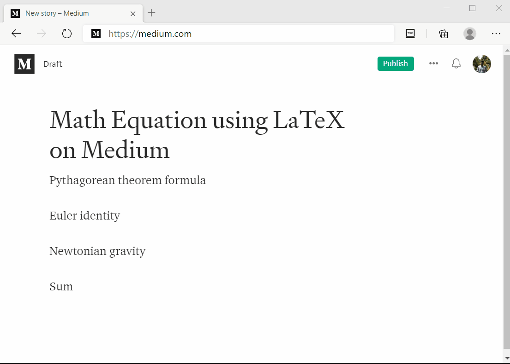

# CodeCogs LaTeX Chrome Extension

**A very simple Chrome extension for LaTex editor based on CodeCogs.**  
Visit CodeCogs: https://www.codecogs.com/latex/eqneditor.php

This Chrome extension was initally created for writing math equations on Medium, because Medium doesn't provide any tool for that.  
After searching a lot of online LaTeX equation editors, I think CodeCogs is the best tool to generate math equations and fortunately the (default format) images generated also look good on Medium. So, rather than having separate tabs to write and copy-paste the equations, I think it'd be good if we have an extension with little popup on browser to do the job.

## Sample
Take a look  

## Installation
I don't have Google account for publishing this extension on Chrome Web Store, but if you want to install it from the source, it's easy.
- Download this source code. Unzip it somewhere. 
- Go to Chrome extensions settings (or just go to url bar: type chrome://extensions and hit enter). 
- Activate developer mode.
- Click "Load Unpack" button and choose the folder where you put the source code.
- Reload the extension if necessary.
